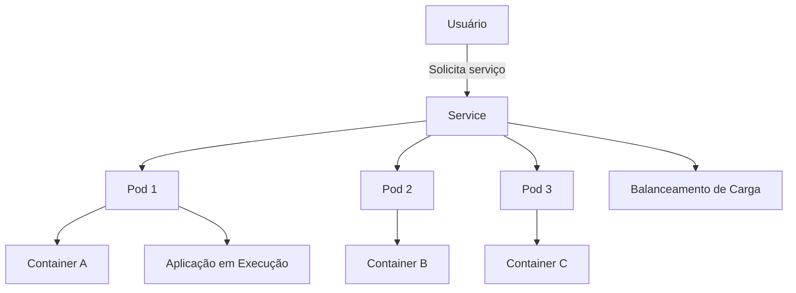

# Kubernetes Overview

## Introdução ao kubernetes

**O que é Kubernetes?**

Kubernetes (ou K8s, como é comumente abreviado) é uma plataforma de código aberto usada para automatizar a implantação, o dimensionamento e o gerenciamento de aplicações em containers. Containers são uma forma de empacotar e isolar uma aplicação com tudo o que ela precisa para rodar — como código, bibliotecas e configurações — de uma maneira que pode ser executada de forma consistente em qualquer ambiente.

Imagina que você tem uma aplicação que precisa rodar em vários computadores diferentes, ou até mesmo em vários locais do mundo. O Kubernetes ajuda a orquestrar (ou seja, gerenciar e coordenar) a execução desses containers, garantindo que sua aplicação seja escalável, estável e fácil de gerenciar.

### Conceitos Importantes do Kubernetes

1. **Container**: É uma unidade leve e portátil de software que contém tudo o que a aplicação precisa para ser executada de maneira isolada.

2. **Cluster**: Um conjunto de máquinas (físicas ou virtuais) que executam as aplicações. No Kubernetes, o cluster é formado por um conjunto de servidores, sendo um "master" (gerenciador) e vários "nodes" (máquinas de trabalho).

3. **Pod**: O menor objeto no Kubernetes. Um pod pode conter um ou mais containers que compartilham o mesmo ambiente de rede e armazenamento.

4. **Deployments**: Uma forma de gerenciar e controlar como uma aplicação (container) deve ser implantada no cluster. Ele garante que o número certo de réplicas de uma aplicação esteja sempre em execução.

5. **Services**: O Kubernetes usa os serviços para garantir que as aplicações possam se comunicar entre si, mesmo quando os containers são movidos ou reiniciados.

6. **ReplicaSet**: Garante que o número desejado de réplicas de um pod esteja sempre em execução.

### Como o Kubernetes Funciona?

Kubernetes facilita o gerenciamento de containers ao realizar várias tarefas automaticamente, como:

- **Escalabilidade**: Ele pode aumentar ou diminuir automaticamente o número de containers em execução dependendo da carga da aplicação.
- **Balanceamento de carga**: Kubernetes distribui automaticamente o tráfego de rede entre os containers, garantindo que os usuários consigam acessar sua aplicação sem sobrecarregar um único servidor.
- **Auto-recuperação**: Se um container falhar, o Kubernetes pode reiniciá-lo ou substituí-lo por outro sem a necessidade de intervenção manual.

A seguir como o Kubernetes organiza a infraestrutura de containers.

### Explicação do Diagrama

1. **Usuário**: Um usuário faz uma solicitação para acessar um serviço (como um site ou aplicativo).
2. **Service**: O Kubernetes direciona a solicitação para o *Service*, que é responsável por distribuir as solicitações para os Pods.
3. **Pods**: O Kubernetes mantém múltiplos pods, cada um executando uma cópia da aplicação.
4. **Containers**: Dentro de cada pod, existe um container que executa a aplicação real.
5. **Balanceamento de Carga**: O serviço se encarrega de balancear as solicitações entre os diferentes pods para garantir que nenhum único pod sobrecarregue.

Esse modelo permite que o Kubernetes se ajuste automaticamente a variações de tráfego e falhas, mantendo a aplicação sempre disponível e escalável.

### Resumo

Kubernetes é uma plataforma poderosa que ajuda empresas a gerenciar suas aplicações de forma eficiente, garantindo alta disponibilidade e escalabilidade, sem que seja necessário gerenciar manualmente cada parte da infraestrutura. Ele cuida de tarefas como distribuir o tráfego de rede, garantir que o número certo de containers esteja em funcionamento e recuperar automaticamente containers que falharem. 

Se você já usou Docker para empacotar aplicações em containers, pode pensar no Kubernetes como um orquestrador que automatiza a execução e o gerenciamento de todos esses containers de forma coordenada.
