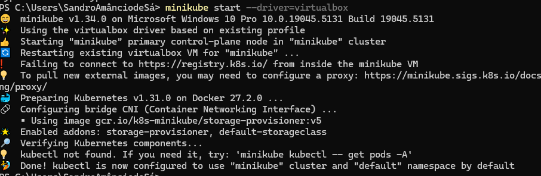
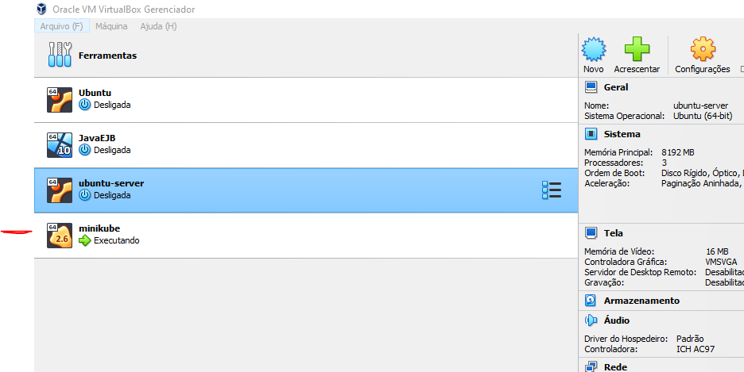

## Criando um Cluster Kubernetes com o Minikube

## Instalação

- No site oficial do [Minikube](https://minikube.sigs.k8s.io/docs/start/?arch=%2Fwindows%2Fx86-64%2Fstable%2F.exe+download), faça o download e execute o instalador da versão mais recente, aqui usamos a versão para Windons

**OBS:** Para executar este conteúdo e necessário ter o virtual box instalado.
# Se tiver o WS2L ou HYPER-V pode haver conflito na instalação

Se você deseja **desativar o WSL2 (Windows Subsystem for Linux 2)** em seu sistema Windows, você pode seguir os passos abaixo, ou ir para **PASSO 4 Instalando o Minikube**
### Passo 1: Desabilitar o WSL2 (Windows Subsystem for Linux 2)

O WSL2 utiliza o Hyper-V e pode causar conflitos com o VirtualBox, que precisa da virtualização de hardware diretamente. Para desabilitar o WSL2, siga os passos abaixo:

1. **Desinstalar Distribuições Linux do WSL**:
   - Abra o **PowerShell** como Administrador.
   - Execute o comando abaixo para listar todas as distribuições Linux instaladas:

     ```powershell
     wsl --list --verbose
     ```

   - Para remover uma distribuição específica (por exemplo, Ubuntu), use o comando:

     ```powershell
     wsl --unregister Ubuntu
     ```

   Repita esse comando para outras distribuições, se necessário.

2. **Desabilitar o WSL e o Virtual Machine Platform**:
   O WSL2 depende de duas funcionalidades do Windows: **WSL** e **Virtual Machine Platform**. Você pode desabilitá-las usando o seguinte comando:

   - **Desabilitar WSL**:

     ```shell
     dism.exe /Online /Disable-Feature /FeatureName:Microsoft-Windows-Subsystem-Linux
     ```

   - **Desabilitar o Virtual Machine Platform (necessário para o WSL2)**:

     ```shell
     dism.exe /Online /Disable-Feature /FeatureName:VirtualMachinePlatform
     ```

3. **Desabilitar o Hyper-V (se necessário)**:
   Se o Hyper-V também estiver ativado e você não precisar dele para outros fins, pode desabilitá-lo com o seguinte comando:

   ```shell
   dism.exe /Online /Disable-Feature /FeatureName:Microsoft-Hyper-V-All
   ```

4. **Reiniciar o Computador**:
   Após desabilitar o WSL2, o Virtual Machine Platform e o Hyper-V, reinicie o computador para que as alterações tenham efeito.

### Passo 2: Verificar se o WSL2 foi Desativado

1. **Verificar se o WSL foi desinstalado corretamente**:
   Após reiniciar, você pode verificar se o WSL foi desabilitado executando o seguinte comando no PowerShell:

   ```shell
   wsl --list --verbose
   ```

   Se o WSL2 foi desabilitado corretamente, nenhuma distribuição Linux será listada.

2. **Verificar o status do Hyper-V**:
   Para garantir que o Hyper-V foi desabilitado corretamente, execute:

   ```shell
      bcdedit
   ```

   A linha **`hypervisorlaunchtype`** deve estar configurada como **Off**.

### Passo 3: Verificar a Virtualização no Windows

1. **Verificar se a virtualização está ativa**:
   Abra o **Gerenciador de Tarefas** (Ctrl + Shift + Esc), vá para a aba **Desempenho**, e selecione **CPU** na coluna à esquerda. Na parte inferior direita, verifique se a **Virtualização** está marcada como **Ativada**.

### Passo 4: Instalando o Minikube 


```bash
minikube start --driver=virtualbox
```



- Visualizar o status 

```bash
  minikube status
```

- Parar o minikube, desliga a maquina virtual

```bash
   minikube stop
```

- Executando o minikube, agora ele só liga a maquina virtual

```bash
   minikube start
```

### Passo 5: Instalando o Kubectl

- No site [kubernetes](https://kubernetes.io/docs/tasks/tools/install-kubectl-windows/), você tem a opção para instalar nos diferentes sistemas operacionais

- Se você tem o curl instaldo basta usar o comando mostrado na pagína. Se não copie apenas o endereço e cole no navegado que será feito o download.

```shell
   curl.exe -LO "https://dl.k8s.io/release/v1.31.0/bin/windows/amd64/kubectl.exe"
```

- Após terminado o download, crie um diretório na unidade C e chame de kubectl, copie o arquivo baixado para dentro do diretório.

- Agora vamos setar uma variável de ambiente. No campo de pesquisa do windows 10 ou 11 basta digita ambiente ou path se o indioma for inglês, e clicar para abrir o Editar as variaveis do sistema.
- selecione path, clique em editar, uma nova caixa se abre, clique em novo e digíte o caminho C:\kubectl, clique em ok, ok de novo, ok de novo.
- Agora ele esta disponivel no sistema todo.

