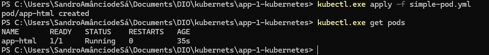
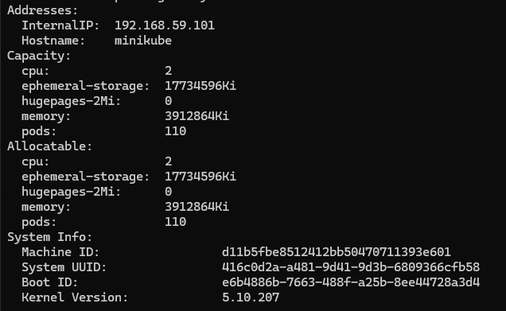
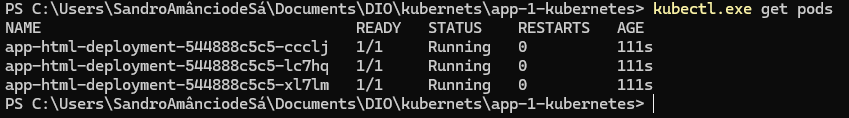
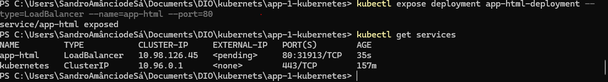
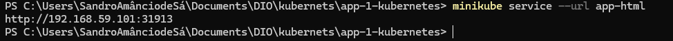
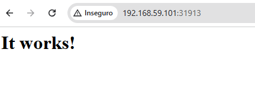

# Conceitos Básicos sobre Pods

## Arquivo YAML

O `.yml` ou `.yaml` é uma linguagem de serialização de dados usada na escrita de arquivos de configuração. Sua indentação é feita por espaços, com dois espaços para cada nível de bloco.

- Exemplo

```yml
apiVersion: v1 # Versão da API
kind: Pod     # Tipo de objeto que está criando
metadata:
  name: app-html 
  labels:
    app: app-html
spec:
  containers:
  - name: app-html # Por padrão, use o mesmo nome do aplicativo
    image: 
    ports:
    - containerPort: 80
```

## Criando o Primeiro YAML

Abra o terminal e crie um diretório para salvar o arquivo `.yml`.

```bash
mkdir app-1-kubernetes
cd app-1-kubernetes
```

Crie um arquivo com o nome `simple-pod.yml` e utilize um editor de texto para auxiliar na elaboração do script.

```yml
apiVersion: v1 
kind: Pod     
metadata:
  name: app-html 
  labels:
    app: app-html
spec:
  containers:
  - name: app-html 
    image: httpd:latest
    ports: 
    - containerPort: 80
```

## Implementando um Pod

Vamos usar o Minikube para implementar um Pod.

```bash
# Inicia o Minikube
minikube start
# Verifica o status. OBS: Se "Kubeconfig: Configured" estiver como "MisConfigured", o arquivo de configuração pode ter falhado. Você pode tentar seguir para a seção de erros deste tutorial para tentar recriá-lo.
minikube status 
# Verifica os serviços que estão em execução. Veja como instalar o kubectl na seção adicional.
kubectl get services 
# Para ver se algum pod está em execução
kubectl.exe get pods
# Para ver os comandos de apply
kubectl.exe apply --help
# -f = nome do arquivo que deseja implementar
kubectl.exe apply -f simple-pod.yml
# Checando se o pod está em execução. OBS: PODE LEVAR ALGUNS MINUTOS PARA INICIAR, DEPENDENDO DA MÁQUINA.
kubectl.exe get pods
```



Pegando informações adicionais sobre os pods:

```bash
kubectl.exe get pod -o wide
```

Perceba que o pod tem um IP, o qual é utilizado para comunicação interna entre os pods.

#### Acessando a Máquina Virtual do Minikube

Para acessar a máquina virtual do Minikube, basta digitar no terminal:

```bash
minikube ssh
```

Agora dentro do Minikube, você tem acesso a mais dados, usando o comando `ip a`.

#### Deletando um Pod

O comando a seguir deleta o Pod, mas não deleta o arquivo de configuração.

```bash
# Para ver o nome do pod
kubectl.exe get pod
# Deletando o pod
kubectl.exe delete pod app-html
```

## Criando um Arquivo de Deployment

Lista de comandos:
- `kubectl.exe get nodes` – Verifica os nós existentes.
- `kubectl.exe describe node minikube` – Mostra as configurações do nó.



Crie um arquivo com o nome `simple-deployment.yml` e utilize um editor de texto para auxiliar na elaboração do script. 

Você pode encontrar as explicações em [Kubernetes Deployment](https://kubernetes.io/docs/concepts/workloads/controllers/deployment/).

```yml
apiVersion: apps/v1 
kind: Deployment    
metadata:
  name: app-html-deployment 
  labels:
    app: app-html
spec:
  replicas: 3
  selector:
    matchLabels:
      app: app-html
  template:
    metadata:
      labels: 
        app: app-html
    spec:
      containers:
      - name: app-html
        image: httpd:latest
        ports: 
        - containerPort: 80
```

Executando o arquivo e visualizando se os pods estão em execução:

```bash
kubectl.exe apply -f simple-deployment.yml
kubectl.exe get pods
```



Você pode tentar excluir um ou mais pods, mas eles serão recriados novamente.  
Os pods ainda não possuem um balanceador para direcionar as cargas e nem estão disponíveis para comunicação externa.  
Você também pode alterar o arquivo colocando mais réplicas e, em seguida, executar o comando `kubectl.exe apply -f simple-deployment.yml` novamente para salvar as alterações.

## Expondo um Deployment

Agora vamos expor um deployment para que um serviço seja direcionado para um dos pods. Lembrando que estamos com 5 pods em um único nó (cluster), sendo que o ideal seria que cada pod estivesse em um servidor, realizando um escalamento horizontal.

Para expor os pods e criar um balanceador de cargas, execute o seguinte comando:

```bash
# Para ver o nome do deployment
kubectl.exe get deployment
# Para expor a porta e criar um balanceador
kubectl expose deployment app-html-deployment --type=LoadBalancer --name=app-html --port=80
# Para ver os serviços em execução
kubectl get services
```



Observe que um serviço de balanceamento de carga está em execução. Nele, temos um IP externo, mas este ainda está pendente. Esse processo pode demorar, dependendo dos recursos disponibilizados para a máquina. Como estamos usando o Minikube, os recursos são limitados, então o IP não será mostrado. 

Mas, para saber qual URL usar para acessar o serviço localmente, execute o comando abaixo:

- OBS: Em um cenário real, com os pods criados na nuvem, o IP estaria disponível e você poderia acessar online.

```bash
minikube service --url app-html
```



Copie e cole o endereço no seu navegador.



### Deletando o Deployment e Serviço

```bash
# Para deletar o deployment
kubectl delete deployment app-html-deployment
# Para deletar o serviço
kubectl delete service app-html
# Checando os deployments
kubectl get deployments
# Checando os serviços
kubectl get services
```

### Adicionais

- Instalando o `kubectl` com o Winget. O Winget é um instalador de pacotes do Windows que permite baixar aplicativos, atualizar e muito mais. Você pode também utilizar a Microsoft Store para instalar, caso não tenha o Winget.

```bash
winget install kubectl
```

- Reinicie o terminal para que as novas configurações sejam carregadas.

```bash
kubectl version
```

---

### Erros

- **Erro "Kubeconfig: MisConfigured"**

1. **Cheque o status**:

```bash
minikube status
```

2. **Inicie o Minikube**:
   Se o Minikube não estiver em execução, tente reiniciá-lo:

```bash
minikube start
```

3. **Verifique o arquivo Kubeconfig**:

- **Se estiver faltando ou corrompido**: Você pode tentar redefinir o kubeconfig executando:

```bash
minikube update-context
```

4. **Recriando o arquivo Kubeconfig**:
   
Se o problema persistir, você pode recriar o kubeconfig manualmente, excluindo o arquivo existente e reinicializando o Minikube:

```bash
del C:\caminho-para-o\.kube\config
minikube start
```