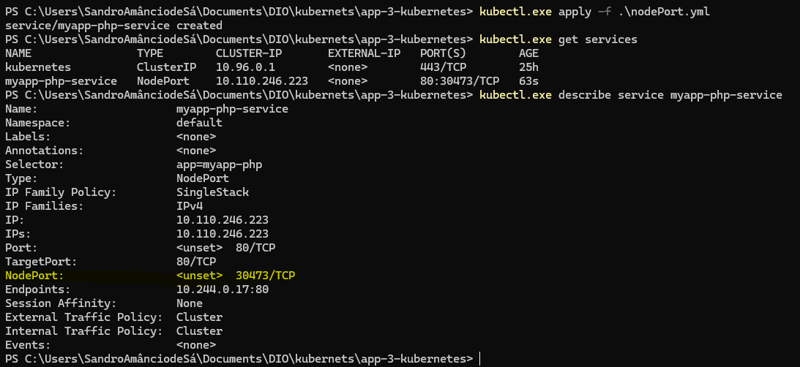
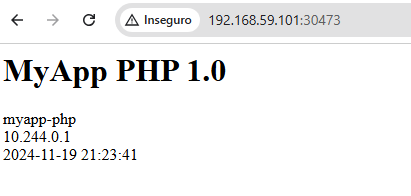
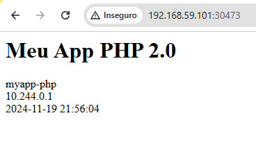
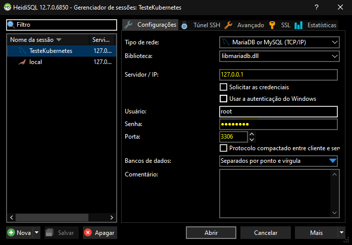
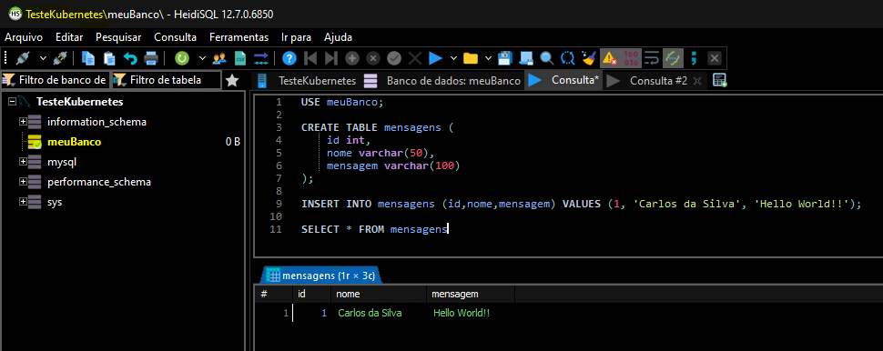
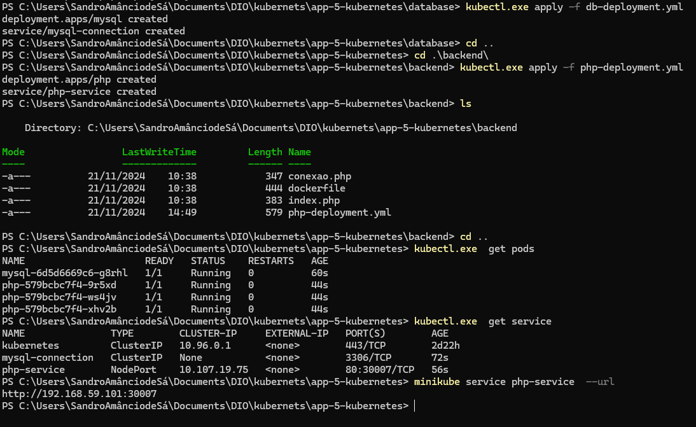
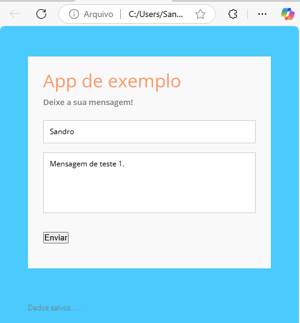
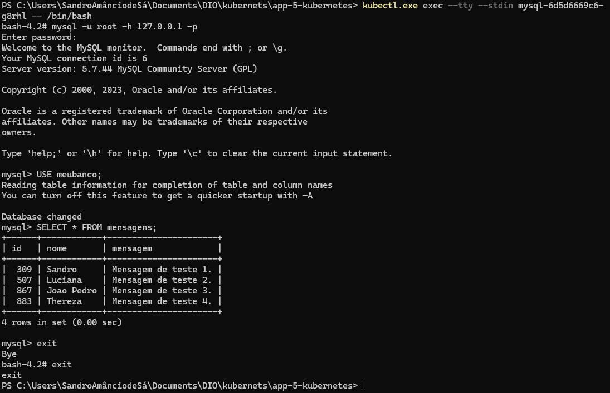
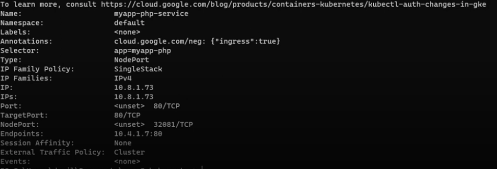

# Serviços de acesso

## Criando um NodePort

O NodePort da acesso a um pode especifico, por exemplo um banco de dados.

Vamos cria nosso ambiente para este exemplo, você pode usar a IDE de sua preferência

```bash
mkdir app-2-kubernetes
cd app-2-kubernetes
nano pod.yml
```
- Codigo do ``pod.yml``

```yml
apiVersion: v1
kind: Pod
metadata:
  name: myapp-php
  labels:
    app: myapp-php
spec:
  containers:
  - name: myapp-php
    image: sandrosa315/myapp-php:1.0
    ports:
    - containerPort: 80
```
- Criando uma aplicação para teste em PHP

```bash
nano index.php
```
- Codigo do ``index.php``

```php
<html>
 <head>
  <title>MyApp PHP 1.0</title>
 </head>
 <body>
    <h1>MyApp PHP 1.0</h1>
        <?php 

        echo gethostname();
        echo "<br>";
        echo $_SERVER["REMOTE_ADDR"];
        echo "<br>";
        echo date('Y-m-d H:i:s');
        
        ?>
 </body>
</html>
```

- Criando um dockerfile para criar uma imagem do servidor apache

```bash
nano dockerfile
```
- Codigo do ``dockerfile``

```dockerfile
FROM php:7.4-apache

WORKDIR /var/www/html
COPY index.php /var/www/html

RUN apt-get update && apt-get install -y \
        libfreetype6-dev \
        libjpeg62-turbo-dev \
        libpng-dev \
    && docker-php-ext-configure gd --with-freetype --with-jpeg \
    && docker-php-ext-install -j$(nproc) gd \
    && docker-php-ext-install pdo_mysql \
    && docker-php-ext-install mysqli


EXPOSE 80
```
- Criando um NodePort para liberar uma porta

```bash
nano nodePort.yml
```
- Codigo do ``nodePort.yml``

```yml
apiVersion: v1
kind: Service
metadata:
  name: myapp-php-service
spec:
  type: NodePort
  selector:
    app: myapp-php
  ports:
    - port: 80
      targetPort: 80
      #nodePort: 30007 # Se não for adicionado, o próprio kubernetes gera aleatório
```

- Gerando a imagem 

```bash
docker build . -t  sandrosa0315/myapp-php:1.0
```
- Enviando a imagem para o DockerHub, precisa estar logado para enviar.

```bash
docker push sandrosa0315/myapp-php:1.0
```

- Criando um pod
```bash
#Criando pod
kubectl.exe apply -f .\pod.yml
# Verificando status do pod, se está Running
kubectl.exe get pod
```

- Criado o acesso ao cluster

```bash
#Criando nodePort
kubectl.exe apply -f .\nodePort.yml
# Verificando o status
kubectl.exe get services
# Verificando configurações do serviço
kubectl.exe describe service myapp-php-service
```


- Observe que o kubernetes gera a porta automaticamente, mas em um cenário real você deve configurar essas portas de acordo com suas funcionalidades.

**OBS:** Lembrando que estamos usando o minikube, e precisamos criar uma URL para acessa o serviço.

```bash
minikube service myapp-php-service --url
```



## Executando aplicações no pod

Para executar um bash no container basta seguir o comando abaixo:

```bash
# exec -> executa o
# stdin -> modo input
# tty -> no terminal
# myapp-php -> do container
# /bin/bash -> o que será executado
kubectl.exe exec --stdin --tty myapp-php -- /bin/bash
```

Com o acesso ao terminal do container, podemos alterar ou intalar pacotes ou programas. Vamos instalar o nano e editar o ``index.php``

```bash
apt-get install nano
nano index.php
```
- Editando o arquivo ``index.php``

```bash
<html>
 <head>
  <title>Meu App PHP 2.0</title>
 </head>
 <body>
    <h1>Meu App PHP 2.0</h1>
        <?php

        echo gethostname();
        echo "<br>";
        echo $_SERVER["REMOTE_ADDR"];
        echo "<br>";
        echo date('Y-m-d H:i:s');

        ?>
 </body>
</html>
```


Para sair do terminal do container basta digitar ``exit`` e tecla enter

```bash
# Saindo do container
exit
# Verificando os pods  em execução
kubectl.exe get pods
# Deletando o pod
kubectl.exe delete pod myapp-php
# Verificando os serviços em execução
kubectl.exe get service
# Deletando o serviço
kubectl.exe delete service myapp-php-service
```
**OBS:** Lembrando que toda operação foi feita no container e não na imagem. Caso o container parar e for preciso executar a imagem novamente ele retorna sem as alterações executadas.


## Deployment e Serviço em um arquivo YAML

Vamos cria nosso ambiente para este exemplo, você pode usar a IDE de sua preferência


```bash
mkdir app-3-kubernetes
cd app-3-kubernetes
nano app-deployment.yml
```

- Criando o  deployment e o serviço no mesmo arquivo

```yml
apiVersion: v1
kind: Pod # poderia usa o deployment
metadata:
  name: myapp-php
spec:
  containers:
  - name: myapp-php
    image: sandrosa0315/myapp-php:1.0
    ports:
    - containerPort: 80

--- ## Separação dos arquivos

apiVersion: v1
kind: Service
metadata:
  name: myapp-php-service
spec:
  type: NodePort
  selector:
    app: myapp-php
  ports:
    - port: 80
      targetPort: 80
      nodePort: 30005 # Precisa ser acima de 30000
```

Executando o arquivo ``app-deployment.yml``

```bash
# Executando o arquivo
kubectl.exe apply -f .\app-deployment.yml
# Verificando se o pod está em execução
kubectl.exe get pod
# Verificando se o serviço está em execução
kubectl.exe get service
# Deletando o pod
kubectl.exe delete pod myapp-php
# Deletando o serviço
kubectl.exe delete service myapp-php-service
```

## Encaminhamento de porta

Vamos cria nosso ambiente para este exemplo, você pode usar a IDE de sua preferência

```bash
mkdir app-4-kubernetes
cd app-4-kubernetes
nano mysql.yml
```
- Editando o arquivo

```yml
apiVersion: v1
kind: Pod
metadata:
  name: mysql-pod
  labels:
    name: mysql-pod
spec:
  containers:
    - name: mysql
      image: mysql:latest
      env:
        - name: "MYSQL_DATABASE"
          value: "meuBanco"
        - name: "MYSQL_ROOT_PASSWORD"
          value: "Senha123" 
      ports:
        - containerPort: 3306

```
Executando o arquivo ``mysql.yml``

```bash
kubectl.exe apply -f .\mysql.yml
kubectl.exe get pod
```
**Nesse caso não temos nenhum serviço para ele, então o pod não tem acesso externo.**
Nesta situação podemos criar um encaminhamento de porta

```bash
kubectl.exe port-forward pod/mysql-pod 3306:3306
```
Agora podemos acessar o banco de dados pela porta criada, não esqueça da senha.
Aqui vou usar HeidiSQL para acessar o banco, você pode usar qualquer client SQL.



- Manipulando o banco de dados.



**OBS:** Lembrando que toda operação foi feita no container e não na imagem. Caso o container parar e for preciso executar a imagem novamente ele retorna sem as alterações executadas.

```bash
kubectl.exe delete pod mysql-pod
```

## Criando conexão com banco de dados

- Neste exemplo faremos uma pequena aplicação que interage com banckend e banco de dados. 
- **Caso não tenha um repositório** vocé pode fazer o testes usando a imagem que eu criei. Mas se prefirir fazer sua imagem, lembre-se de editar os arquivos com seu nome de login do DockerHub ``usernamedockerhub/php:1.0``, ``usernamedockerhub/meubanco:1.0``.
- Como não tenho o docker instalado no Windows, estou utilizando um máquina virtual com Ubuntu server para criação das imagens e envio para o DockerHub. Após as imagens serem criadas e enviadas para o repositório, desligo a maquina e retorno para o Windows.
- Os arquivos para criação deste ambiente estão no diretório app-5-kubernetes

- No diretório database temos:
  - Arquivo ``dockerfile`` responsável por criar a imagem do banco de dados que será enviada para o seu repositório com as variavéis de ambiente, importar dados para criar uma tabela e expor a porta padrão do mysql.
  - Arquivo ``db-deploiment.yml`` Criamos um deploymente chamando a imagem criada no repositório, não criamos replicas para criar um volume unico para todas as replicas depois. Para segurança o banco de dados só terá comunicação dentro do cluster, sem um IP para acesso externo. No mesmo arquivo estamos criando um serviço para realizar a conexão 
  - Arquivo ``sql.sql`` contém o script para criação da tabela

- No diretório backend:
  - Arquivo ``conexao.php``  faz a conexão com o banco de dados utilizando mysqli para se conectar, utilizando o nome do serviço criado ``mysql-conenction`` no lugar do ip ou dns do servidor de bnanco de dados como de costume.
  - Arquivo ``ìndex.php`` pega dados de um formúlario e inseri no banco de dados.
  - Arquivo ``dockerfile`` cria uma imagem do PHP com o Apache expondo a porta 80 e copia os arquivos ``conexao.php`` e ``ìndex.php`` para a imagem. Tambem instalamos as algumas bibliocas como a do ``mysqli`` para a conexão funcionar.
  - Aquivo ``php-deployment.yml`` utilizado para chamar a imagem do backend enviada para o repositório. Dentro das specificações estamos adotando 3 replicas e utilizamos a porta 80 para comunicação. Neste caso será preciso acessar o backend, então criamos um servico  utilizando o NodePort, criando a porta 30005 para se comunicar

- No diretorio frontend:
  - Arquivo ``css.css`` com o estilo para pagina do cliente.
  - Arquivo ``js.js`` um script ajax, para fazer a conexão com o backend.
  - Arquivo ``index.html`` uma interface com um simples formulario.

### Criando imagens

Criação da imagem do banco e envio para o repositório

- Dentro do diretório app-5-kubernetes/database, execute o seguintes passos.

```bash
# Para cria a imagem
docker build . -t sandrosa0315/meubanco:1.0
# Enviar para o repositorio do DockerHub
docker push sandrosa0315/meubanco:1.0
```

Criação da imagem do servidor HTTPS e envio para o repositório

- Dentro do diretório app-5-kubernetes/backend, execute o seguintes passos.

```bash
# Para cria a imagem
docker build . -t sandrosa0315/php:1.0
# Enviar para o repositorio do DockerHub
docker push sandrosa0315/php:1.0
```
### Criando deployment do banco de dados

Vamos inicializar o minikube para fazer os deploys

```bash
# Inicia o minikube
minikube start
# Deployment do banco de dados
kubectl.exe apply -f db-deployment.yml
# aqui verificamos que foi criado um pod só
kubectl.exe  get pods
# aqui verificamos  o serviço que foi criado
kubectl.exe  get service
```

### Criando o deployment do backend

```bash

# Deployment do banco de dados
kubectl.exe apply -f php-deployment.yml
# aqui verificamos que foi criado um pod só
kubectl.exe  get pods
# aqui verificamos  o serviço que foi criado
kubectl.exe  get service
# Criando um URL para acesso no minikube. NÂO È NECESSÁRIO SE ESTIVER NA NUVEM
minikube service php-service  --url
```



**OBS:** se você estiver usando uma cloud, talvez precise criar uma regra para o firewall liberar a porta

### Interação do sistema

Agora com a URL em dispónivel, vamos abrir o arquivo ``js.js`` e substituir a url para acessar o backend. Save as alterações.
Em seguida basta abrir o arquivo ``index.html`` em seu navegador de preferência, e inserir alguns dados



Para verificar se os dados estão sendo salvo vamos acessar o banco de dados através de um bash, porque o mysql roda em cima de um Linux.

```bash
# Para executar um bash
kubectl.exe exec --tty --stdin mysql-6d5d6669c6-g8rhl -- /bin/bash
# Para se conectar ao mysql, vai pedir a senha.
mysql -u root -h 127.0.0.1 -p
# Para qual banco
Use meubanco;
# Selecionado os dados do banco
SELECT * FROM mensagens;
```


**OBS:** Lembrando que os dados ainda não estão sendo persistidos em nenhum volume.


## COMANDOS PARA USO NO GOOGLE CLOUD

O comando ``gcloud compute instances list`` tráz a lista de servidores com tipo de máquina e IPs 
O comando ``kubectl.exe get nodes -o wide`` tráz a lista de servidores também com tipo de máquina e Ips 
O comando ``kubectl.exe apply -f .\nodePort.yml`` executa  o arquivo
O comando ``kubectl.exe describe service myapp-php-service` mostra as configurações do nodePort 

O comando ``gcloud compute firewall-rules create my-app-php --allow tcp:32081` da permisão para acessar a porta 32081 pelo protocolo TCP.
