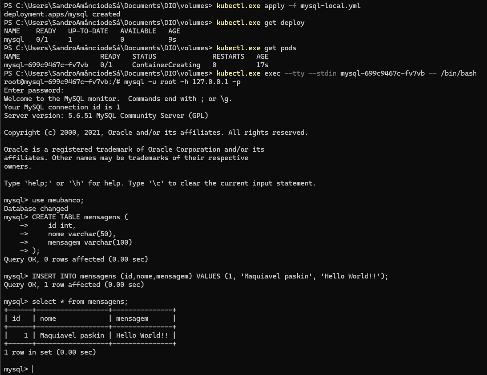

# Persistência de dados

## Introdução

No contexto de Kubernetes, **PersistentVolume (PV)** e **PersistentVolumeClaim (PVC)** são recursos utilizados para gerenciar o armazenamento persistente em clusters Kubernetes. Eles permitem que dados sejam armazenados de forma persistente, mesmo que os pods que os utilizam sejam destruídos e recriados. Aqui está a explicação detalhada de ambos:

### 1. **PersistentVolume (PV)**

Um **PersistentVolume** é uma abstração do armazenamento físico em um cluster Kubernetes. Ele representa um recurso de armazenamento no ambiente de execução do Kubernetes que pode ser provisionado e gerido de forma independente dos pods.

#### Características do PersistentVolume:
- **Recurso do Cluster:** O PV é criado e gerenciado pelo administrador do cluster, geralmente via uma configuração de armazenamento de rede (como NFS, iSCSI, ou armazenamento em nuvem).
- **Capacidade:** O PV tem uma capacidade de armazenamento definida (por exemplo, 10Gi, 100Gi).
- **Provisionamento:** Pode ser provisionado manualmente (pelo administrador) ou automaticamente (via StorageClass).
- **Reutilização:** Pode ser configurado para ser reutilizado após um pod terminar de usar o volume, de acordo com o tipo de política de retenção (como Retain, Delete ou Recycle).

#### Exemplo de um recurso PersistentVolume:

```yaml
apiVersion: v1
kind: PersistentVolume
metadata:
  name: exemplo-pv
spec:
  capacity:
    storage: 5Gi
  volumeMode: Filesystem
  accessModes:
    - ReadWriteOnce
  persistentVolumeReclaimPolicy: Retain
  storageClassName: standard
  hostPath:
    path: /mnt/data
```

Neste exemplo:
- O PV tem 5 GiB de armazenamento.
- Ele usa o `hostPath`, indicando que está baseado no sistema de arquivos local do nó.
- A política de **reclamação** (`persistentVolumeReclaimPolicy`) está configurada para **Retain**, o que significa que o volume não será deletado automaticamente quando o PVC for liberado.

### 2. **PersistentVolumeClaim (PVC)**

O **PersistentVolumeClaim** é uma requisição de armazenamento feita por um usuário ou pod. Ele solicita um volume com características específicas (capacidade, modo de acesso, etc.) e o Kubernetes se encarrega de ligar esse PVC a um PV disponível que atenda aos requisitos solicitados.

#### Características do PersistentVolumeClaim:
- **Requisição de Armazenamento:** O PVC define a quantidade de armazenamento necessária e os modos de acesso desejados.
- **Binding Automático:** O Kubernetes automaticamente faz o "binding" (associação) de um PVC a um PV que tenha a capacidade e os requisitos adequados.
- **Recurso de Usuário:** Enquanto o PV é um recurso gerenciado pelo administrador, o PVC é um recurso solicitado por usuários ou aplicações.

#### Exemplo de um recurso PersistentVolumeClaim:

```yaml
apiVersion: v1
kind: PersistentVolumeClaim
metadata:
  name: exemplo-pvc
spec:
  accessModes:
    - ReadWriteOnce
  resources:
    requests:
      storage: 5Gi
  storageClassName: standard
```

Neste exemplo:
- O PVC está pedindo um volume de **5 GiB** de armazenamento.
- A política de acesso é **ReadWriteOnce**, o que significa que o volume só pode ser montado por um único pod em leitura e escrita.
- O **StorageClassName** é `standard`, o que ajuda a determinar o tipo de provisionamento e onde o volume deve ser alocado.

### Como funciona a interação entre PV e PVC

- O **Administrador** cria os **PersistentVolumes** (PV), que representam os recursos de armazenamento físico disponíveis no cluster.
- O **Usuário/Aplicação** cria um **PersistentVolumeClaim** (PVC), que define as necessidades de armazenamento (como tamanho e modo de acesso).
- O Kubernetes automaticamente **associa** o PVC a um PV que atenda aos requisitos solicitados, se disponível. Se não houver um PV adequado, o PVC ficará em estado de **pendente** até que um PV adequado esteja disponível.

### Ciclo de Vida:
1. **Provisionamento:** O administrador ou o Kubernetes (com StorageClass) provisiona um PV.
2. **Requisição:** O usuário cria um PVC para solicitar um volume de armazenamento.
3. **Binding:** O Kubernetes associa o PVC ao PV, garantindo que os requisitos do PVC sejam atendidos.
4. **Uso:** O pod que solicitar o PVC pode acessar o volume associado, e esse armazenamento persiste além do ciclo de vida do pod.
5. **Desalocação:** Após o uso, o PVC é deletado. Dependendo da política de retenção do PV, ele pode ser liberado ou excluído.

### Diferença entre PV e PVC:

- **PV**: É o recurso de armazenamento físico, gerenciado pelo administrador, com a configuração de como o armazenamento será acessado e onde ele está localizado.
- **PVC**: É uma requisição do usuário para alocar esse recurso de armazenamento, descrevendo o que ele precisa (como tamanho e modo de acesso).

### Exemplo de Fluxo Completo

1. **Administração do Cluster:** O administrador cria um PV de 10 GiB.
2. **Usuário:** Um desenvolvedor cria um PVC pedindo 5 GiB de armazenamento com `ReadWriteOnce`.
3. O Kubernetes encontra o PV de 10 GiB e faz o binding (associa) ao PVC do usuário.
4. O pod pode então usar o PVC para armazenar dados de forma persistente.

Este modelo desacopla a definição do armazenamento (PV) da sua utilização (PVC), permitindo maior flexibilidade na gestão e provisionamento de armazenamento dentro do Kubernetes.

## Criando os arquivos de configurações do PVC no cluster

**Este e exemplo e simplificado para uso em estudo, não devendo ser aplicado ao mundo real**

- Vamos criar uma persistência de dados no custer local, sé você tentar criar este mesmo recurso na nuvem, ele será bloqueado porque precisa de permisão para criar o diretório no cluster.
- Neste exemplo não será criado o persistentVolume, assim naão temos a quantidade de dados que vai ser inserida locamente.

Criando o ambiente

```bash
mkdir volumes
cd volumes
nano mysql-local.yml
```
Inserir estes dados no arquivo  ``mysql-local.yml``

```yml
apiVersion: apps/v1
kind: Deployment
metadata:
  name: mysql
spec:
  selector:
    matchLabels:
      app: mysql
  template:
    metadata:
      labels:
        app: mysql
    spec:
      containers:
      - image: mysql:5.6
        name: mysql
        env:
          # Não e aconselhavel colocar a senha aqui
        - name: MYSQL_ROOT_PASSWORD
          value: Senha123
        - name: MYSQL_DATABASE
          value: meubanco
        ports:
        - containerPort: 3306
          name: mysql
        # NOTE
        volumeMounts:
        - name: local
          mountPath: /var/lib/mysql
      volumes:
      - name: local
        hostPath:
          path: /meubanco/
```

- **NOTE** neste exemplo o volume será persistido no diretório meubanco que vamos criar no servidor

- Neste momento você já esta familiarizado com os comandos abaixo, não vamos mais comentar, vamos criar um deployment, criar uma tabela, e inserir uma dado. Em seguida vamos deletar o deploy

```bash
kubectl.exe apply -f mysql-local.yml
kubectl.exe get deploy
kubectl.exe get pods
kubectl.exe exec --tty --stdin nomedopod -- /bin/bash
mysql -u root -h 127.0.0.1 -p
use meubanco;
CREATE TABLE mensagens (
    id int,
    nome varchar(50),
    mensagem varchar(100)
);
INSERT INTO mensagens (id,nome,mensagem) VALUES (1, 'Maquiavel paskin', 'Hello World!!');
select * from mensagens;
exit
exit
kubectl.exe delete deploy mysql
```



- Agora vamos refazer o deploy para ver se os dados estão não foram perdidos.

```bash
kubectl.exe apply -f mysql-local.yml
kubectl.exe get pods
kubectl.exe exec --tty --stdin nomedopod -- /bin/bash
mysql -u root -h 127.0.0.1 -p
use meubanco;
exit
exit
kubectl.exe delete deploy mysql
```


## Criando os arquivos de configuração do PV e PVC

Criando o PV

```bash
cd volumes
# Craindo arquivo persistentVolume
nano pv.yml
```
Inserir estes dados no arquivo  ``pv.yml``

```yml
apiVersion: v1
kind: PersistentVolume
metadata:
  name: local
  labels:
    type: local
spec:
  storageClassName: manual
  capacity:
    storage: 100Mi #1Gi
  acessModes:
    - ReadWriteOnce
  hostPath: /meubanco/
```

Execundo o persistent volume

```bash
kubectl.exe apply -f pv.yml
kubectl.exe get pv
```

Criando o PVC

```bash
cd volumes
# Craindo arquivo persistentVolume
nano pvc.yml
```
Inserir estes dados no arquivo  ``pvc.yml``

```yml
apiVersion: v1
kind: PersistentVolumeClaim
metadata:
  name: local
spec:
  storageClassName: manual
  accessModes:
    - ReadWriteOnce
  resources:
    requests:
      storage: 100Mi
```

Execundo o persistent volume Claim

```bash
kubectl.exe apply -f pvc.yml
kubectl.exe get pvc
```

Criando o ambiente

```bash
mkdir volumes
cd volumes
nano mysql-local-pv-pvc.yml
```
Inserir estes dados no arquivo  ``mysql-local-pv-pvc.yml``

```yml
apiVersion: apps/v1
kind: Deployment
metadata:
  name: mysql
spec:
  selector:
    matchLabels:
      app: mysql
  template:
    metadata:
      labels:
        app: mysql
    spec:
      containers:
      - image: mysql:5.6
        name: mysql
        env:
          # Não e aconselhavel colocar a senha aqui
        - name: MYSQL_ROOT_PASSWORD
          value: Senha123
        - name: MYSQL_DATABASE
          value: meubanco
        ports:
        - containerPort: 3306
          name: mysql
        # NOTE
        volumeMounts:
        - name: local
          mountPath: /var/lib/mysql
      volumes:
      - name: local
        persistentVolumeClaim:
          claimName: local

```

Execundo o deploy

```bash
kubectl.exe apply -f mysql-local-pv-pvc.yml
kubectl.exe get pods
kubectl.exe get deploy
kubectl.exe exec --tty --stdin nomedopod -- /bin/bash
mysql -u root -h 127.0.0.1 -p
use meubanco;
select * from mensagens;
INSERT INTO mensagens (id,nome,mensagem) VALUES (2, 'Arquimedes Mallis', 'Hello World 2!!');
exit
exit
kubectl.exe delete deploy mysql
```

## Armazenamento persistente em nuvem (GCP)


Criando o ambiente

```bash
mkdir volumes
cd volumes
nano mysql-gcp-pv-pvc.yml
```

No GCP não precisa criar um PV, basta criar um PVC que ele automaticamente provisiona um disco persistente. Você pode consultar [aqui](https://cloud.google.com/kubernetes-engine/docs/concepts/persistent-volumes?hl=pt-br) no site da google cloud um exemplo.


```yml
# pvc-pod-demo.yaml
apiVersion: v1
kind: PersistentVolumeClaim
metadata:
  name: pvc-gcp
spec:
  accessModes:
    - ReadWriteOnce # Qualquer pode de qualquer nó pode ler, gravar e apagar somente do mesmo nó
  resources:
    requests:
      storage: 10Gi
  storageClassName: standard-rwo

---

apiVersion: apps/v1
kind: Deployment
metadata:
  name: mysql
spec:
  selector:
    matchLabels:
      app: mysql
  template:
    metadata:
      labels:
        app: mysql
    spec:
      containers:
      - image: mysql:5.6
        name: mysql
        env:
          # Não é aconselhavel colocar a senha aqui
        - name: MYSQL_ROOT_PASSWORD
          value: Senha123
        - name: MYSQL_DATABASE
          value: meubanco
        ports:
        - containerPort: 3306
          name: mysql
        # NOTE
        volumeMounts:
        - name: pvc-gcp
          mountPath: /var/lib/mysql
      volumes:
      - name: pvc-gcp
        persistentVolumeClaim:
          claimName: pvc-gcp

```

Subindo o cluster e testando DB. **OBS:** precisa estar conectado na GCP

```bash
kubectl.exe apply -f mysql-deploy.ymal
kubectl.exe get pv
kubectl.exe get pods
kubectl.exe exec --tty --stdin nomedopod -- /bin/bash
mysql -u root -p
use meubanco;
CREATE TABLE mensagens (
    id int,
    nome varchar(50),
    mensagem varchar(100)
);
INSERT INTO mensagens (id,nome,mensagem) VALUES (1, 'Maquiavel paskin', 'Hello World!!');
select * from mensagens;
exit
exit
kubectl.exe get pods -o wide
```


Replicando pods


```yml
# pvc-pod-demo.yaml
apiVersion: v1
kind: PersistentVolumeClaim
metadata:
  name: pvc-gcp
spec:
  accessModes:
    - ReadWriteOnce # Qualquer pode de qualquer nó pode ler, gravar e apagar somente do mesmo nó
  resources:
    requests:
      storage: 10Gi
  storageClassName: standard-rwo

---

apiVersion: apps/v1
kind: Deployment
metadata:
  name: mysql
spec:
  replicas: 6
  selector:
    matchLabels:
      app: mysql
  template:
    metadata:
      labels:
        app: mysql
    spec:
      containers:
      - image: mysql:5.6
        name: mysql
        env:
          # Não é aconselhavel colocar a senha aqui
        - name: MYSQL_ROOT_PASSWORD
          value: Senha123
        - name: MYSQL_DATABASE
          value: meubanco
        ports:
        - containerPort: 3306
          name: mysql
        # NOTE
        volumeMounts:
        - name: pvc-gcp
          mountPath: /var/lib/mysql
      volumes:
      - name: pvc-gcp
        persistentVolumeClaim:
          claimName: pvc-gcp

```

Subindo o cluster e testando DB. **OBS:** as replicas não vão ser todas craidas criadas

```bash
kubectl.exe apply -f mysql-deploy.ymal
kubectl.exe get pv
kubectl.exe get pods
kubectl.exe exec --tty --stdin nomedopod -- /bin/bash
mysql -u root -p
use meubanco;
CREATE TABLE mensagens (
    id int,
    nome varchar(50),
    mensagem varchar(100)
);
INSERT INTO mensagens (id,nome,mensagem) VALUES (1, 'Maquiavel paskin', 'Hello World!!');
select * from mensagens;
exit
exit
kubectl.exe get pods -o wide
```

## Utilizando um servidor NFS cloud Filestore

Procure por filestone na Google Cloud
Crie uma instância. O tamanho minímo era de 1T, então o serviço basico com HDD e bem caro e pode ficar muito mais dependendo dos recursos utilizados.
Um IP será disponíbilizado , atráves dele acessamos o disco

Criando o ambiente

```bash
mkdir volumes
cd volumes
nano http-nfs.yml
```

```yml
apiVersion: v1
kind: PersistentVolume
metadata:
  name: fileserver-httpd # crie um nome 
spec:
  capacity:
    storage: 50Gi # lembre-se que estamos usado 50 giga de 1 terra
  accessModes:
    - ReadWriteMany
  nfs:
    path: /nome-dado-para-o-filestore # alterar aqui
    serve: ip-disponibilizado # alterar aqui


---

apiVersion: v1
kind: PersistentVolumeClaim
metadata:
  name: fileserver-httpd #  mesmo nome dado anteriormente
spec:
  accessModes:
    - ReadWriteMany
  storageClassName: "" # Deixar em branco
  volumeName:
    resources:
      requests:
       storage: 50Gi # quanto vc vai usar do disco?

---

apiVersion: apps/v1 
kind: Deployment    
metadata:
  name: http 
spec:
  replicas: 6
  selector:
    matchLabels:
      app: http
  template:
    metadata:
      labels: 
        app: http
    spec:
      containers:
      - name: http
        image: httpd:latest
        ports: 
        - containerPort: 80
          name: http
        
        volumeMounts:
        - name: fileserver-httpd
          mountPath: /usr/local/apache2/htdocs/ # local indicado pela doc. no dockerhub
      volumes:
      - name: fileserver-httpd
        persistentVolumeClaim:
          claimName: fileserver-httpd

```

Subindo os pods

```bash
kubectl.exe apply -f http-nfs.yml
kubectl.exe get pods -o wide
```

Crie um index.html para teste com algum conteúdo.
Em seguida vamos copiar para dentro de um pod e ver se vai ser replicado.

```bash
kubectl.exe cp index.html name-pod:/usr/local/apache2/htdocs/ 
# Teste em outros pods para ver se foi replicado
kubectl.exe exec --tty --stdin nomedopod -- /bin/bash
```


